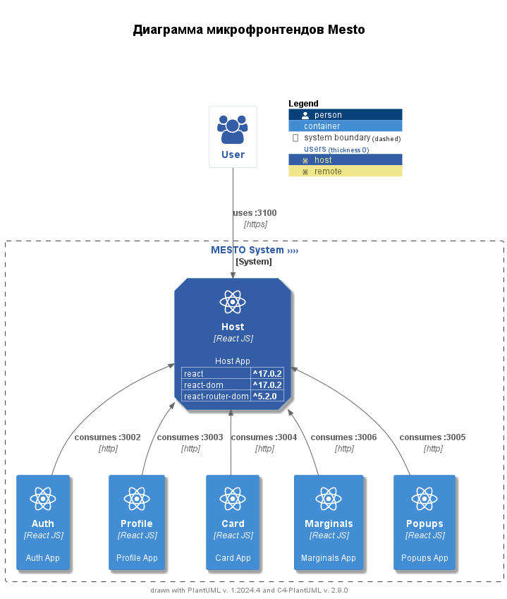

# Проектная работа 1.

## Архитектура микрофронтендов Mesto

### Запуск

```bash
cd frontend
docker compose up -d
```

### Обзор модулей

Этот документ предоставляет обзор архитектуры микрофронтендов для проекта Mesto.
Каждый микрофронтенд реализован как отдельное React-приложение и интегрируется с использованием `Webpack Module Federation`.
Управление состоянием и контекстами осуществляется на Хосте (Модуль `Host`).
Архитектура включает следующие компоненты:

- Модуль `Host`
- Модуль `Auth`
- Модуль `Profile`
- Модуль `Card`
- Модуль `Marginals`
- Модуль `Commons`

#### Обоснование паттерна

- Команды одного стека `React JS`.
- Простой компонентный состав.
- Не требуется перенастройка маршрутизации, возможность использовать `React Router`.
  В дальнейшем можно выделить в отдельный модуль.
- Совместное использование библиотек, контроль версионности.

### Диаграмма



### Модули и компоненты

#### Модуль Host

- **Название:** Host
- **Технология:** `React JS`
- **Описание:** Основное приложение, которое служит хостом для других микрофронтендов.
- **Функции:** Управление состоянием, routing, композиция.
- **Порт:** 3100
- **Зависимости:**
    - Auth (потребляет)
    - Profile (потребляет)
    - Card (потребляет)
    - Marginals (потребляет)
    - Commons (потребляет)

##### Компоненты

- **App**: Главный компонент приложения, который инициализирует другие компоненты.
- **Main**: Основной компонент, который управляет основным содержимым страницы.
- **Router**: Компонент, который управляет маршрутизацией внутри приложения.

#### Модуль Auth

- **Название:** Auth
- **Технология:** `React JS`
- **Описание:** Модуль, ответственный за функции аутентификации, включая вход и регистрацию.
- **Порт:** 3002
- **Экспонирует:**
    - `./Register`
    - `./Login`
- **Зависимости:**
    - Commons (потребляет)

##### Компоненты

- **Login**: Компонент для входа пользователя.
- **Register**: Компонент для регистрации нового пользователя.

#### Модуль Profile

- **Название:** Profile
- **Технология:** `React JS`
- **Описание:** Модуль, ответственный за функции профиля пользователя, включая редактирование информации профиля.
- **Порт:** 3003
- **Экспонирует:**
    - `./Profile`
    - `./EditAvatarPopup`
    - `./EditProfilePopup`
- **Зависимости:**
    - Commons (потребляет)

##### Компоненты

- **Profile**: Основной компонент профиля пользователя.
- **Edit Avatar Popup**: Компонент для редактирования аватара пользователя.
- **Edit Profile Popup**: Компонент для редактирования информации профиля пользователя.

#### Модуль Card

- **Название:** Card
- **Технология:** `React JS`
- **Описание:** Модуль, ответственный за управление карточками, включая отображение списков карточек и добавление новых карточек.
- **Порт:** 3004
- **Экспонирует:**
    - `./Card`
    - `./CardList`
    - `./AddPlacePopup`
- **Зависимости:**
    - Commons (потребляет)

##### Компоненты

- **Card**: Основной компонент для отображения карточек.
- **Card List**: Компонент для отображения списка карточек.
- **Add Place Popup**: Компонент для добавления новой карточки.

#### Модуль Marginals

- **Название:** Marginals
- **Технология:** `React JS`
- **Описание:** Модуль, ответственный за общие UI-компоненты, такие как шапка и подвал.
- **Порт:** 3006
- **Экспонирует:**
    - `./Header`
    - `./Footer`

##### Компоненты

- **Header**: Компонент шапки сайта.
- **Footer**: Компонент подвала сайта.

#### Модуль Commons

- **Название:** Commons
- **Технология:** `React JS`
- **Описание:** Модуль, предоставляющий общие компоненты, которые используются в других микрофронтендах.
- **Порт:** 3005
- **Экспонирует:**
    - `./ImagePopup`
    - `./PopupWithForm`
    - `./InfoTooltip`

##### Компоненты

- **Info Tooltip**: Компонент для отображения информационных всплывающих подсказок.
- **Popup With Form**: Компонент для всплывающих окон с формами.
- **Image Popup**: Компонент для отображения всплывающих окон с изображениями.

### Взаимоотношения

- **Пользователь** взаимодействует с **Host** приложением через порт `3100` по `HTTPS`.
- **Host** потребляет следующие приложения через `HTTP`:
    - `Auth` : `3002`
    - `Profile` : `3003`
    - `Card` : `3004`
    - `Marginals` : `3006`
    - `Commons` : `3005`
- **Profile** и **Card** приложения потребляют **Commons** приложение через `HTTP` (порт `3005`).

### Используемые Технологии

- **`React`**: версия ^17.0.2
- **`React DOM`**: версия ^17.0.2
- **`React Router DOM`**: версия ^5.2.0

### Генерация Диаграммы

Диаграмма сгенерирована с использованием `PlantUML` и расширения `C4-PlantUML`.
Для просмотра или изменения диаграммы используйте исходный код `PlantUML`, предоставленный в репозитории.

## Система управления торговыми площадками

[Декомпозиция монолита](docs/praktikum_arch_template.drawio)